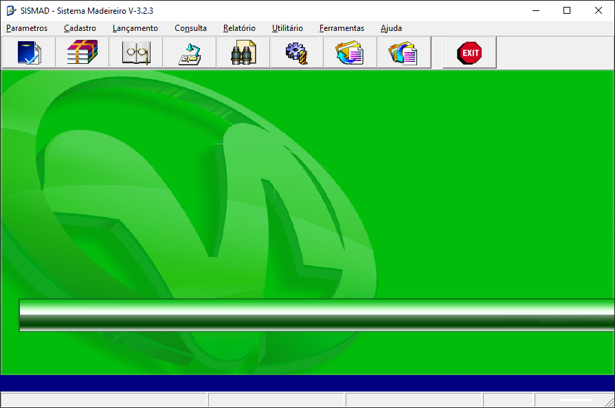

## Sismad

Sismad é um sistema de controle de estoque de madeiras.  
Desenvolvido em **Delphi 7 + Firebird 2.5 + QuickReport**.  
Disponível somente o **código-fonte** do projeto.

### ⚠️ Arquivos **não** disponíveis:
- Banco de dados  
- Skin  
- `GDS32.dll`  
- Arquivo `Config.ini`  
- Código do instalador

### 📫 Contato
- 📧 hfsoftwaree@gmail.com

Tela do sistema: 
  
